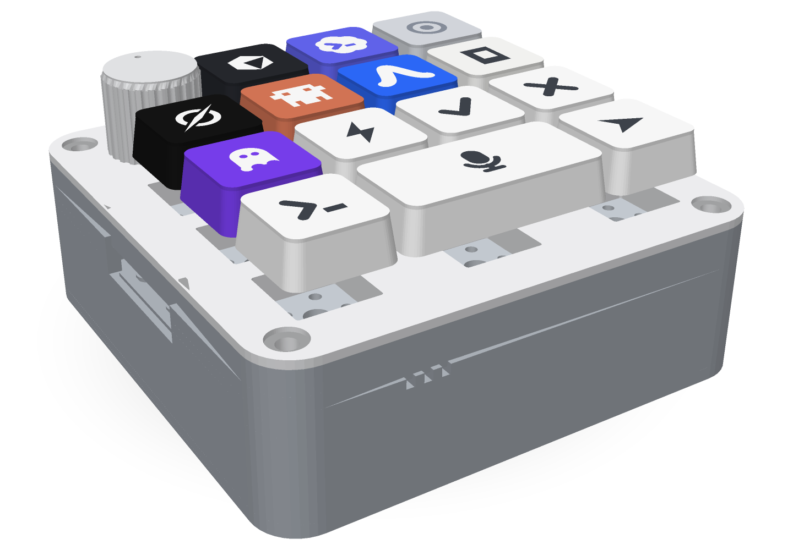
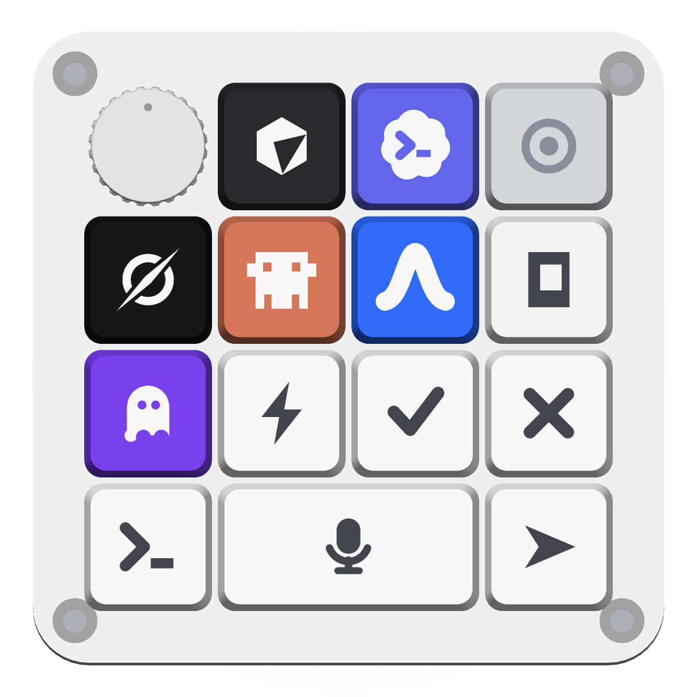
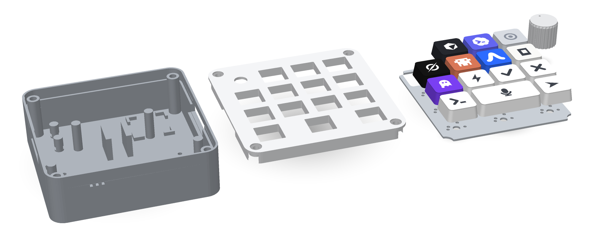
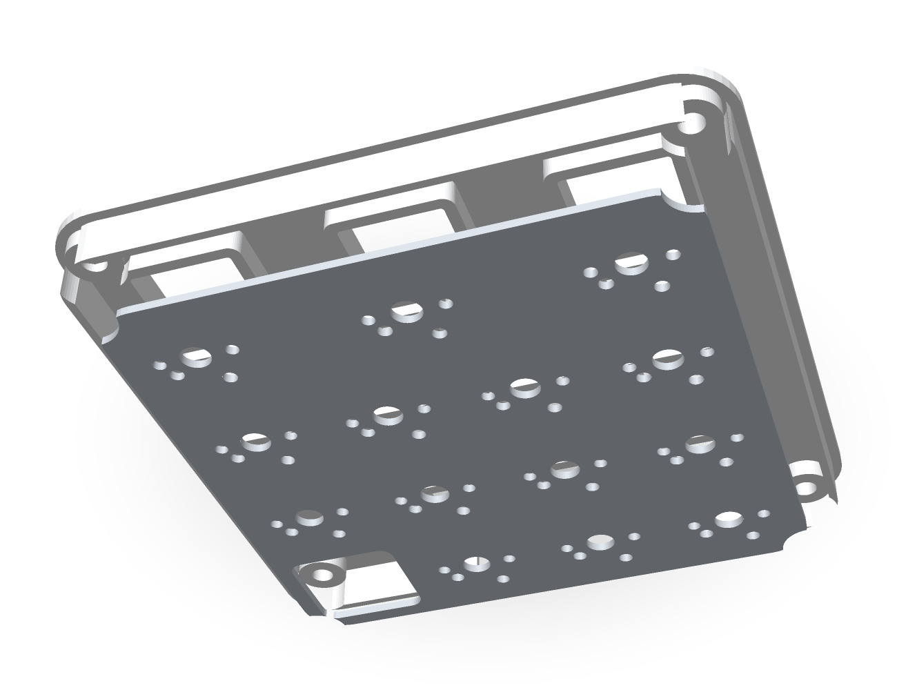
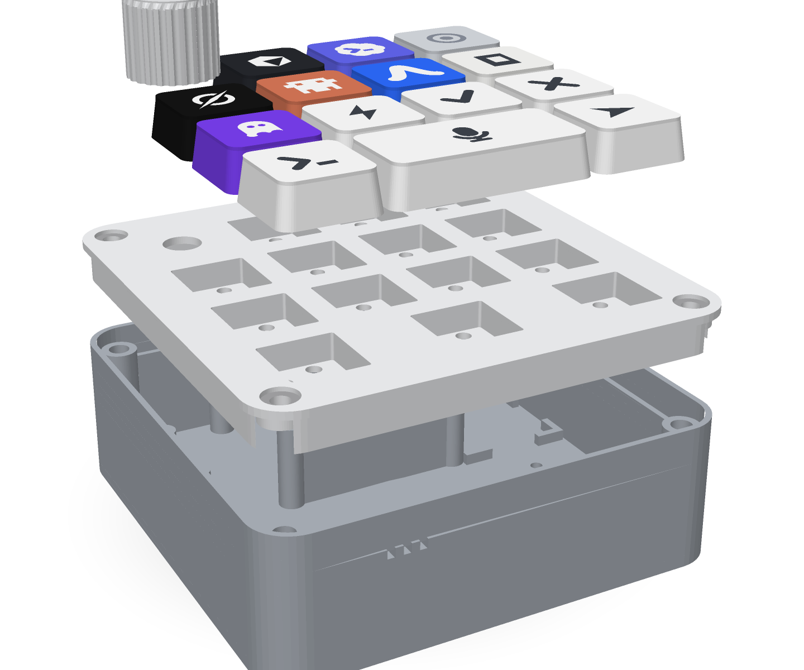
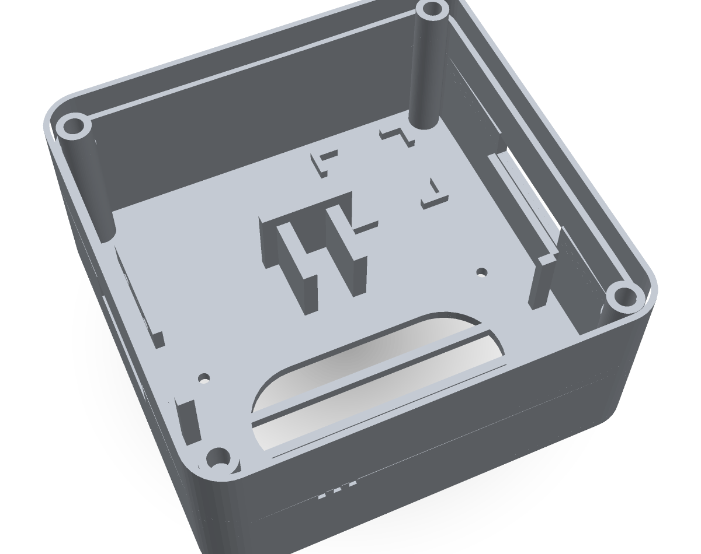

<div align="center">



# Orchestrator Pad

**A desk controller for your coding agents.**
Lock an agent with one key. Hold the bar and talk. Twist the dial to set how hard the model thinks.

[](LICENSE)
[](https://www.espressif.com/en/products/devkits)
[](#print-it)
[](#the-cad-is-code)
[](#roadmap)

[Print it](#print-it) · [What's inside](#whats-inside) · [How a job flows](#how-a-job-flows) · [The CAD is code](#the-cad-is-code) · [Roadmap](#roadmap)

</div>

---

Pointing five different CLI agents at your projects means five terminals and a
lot of retyping. The Orchestrator Pad is a small (~90 × 90 mm) open-source
macropad that turns the routing into muscle memory: **one key per agent, one
bar for your voice, one dial for effort** — from `low` all the way up to
`ultracode`. It speaks Wi-Fi to your orchestrator daemon, with USB-HID as the
fallback.

Everything here is remixable: the enclosure is parametric Python, the agents
on the caps are just a table in `cad/partlib.py`, and the whole thing prints
on a bed-slinger in an evening.

## The deck

<div align="center">

</div>

| | Key | Cap | What it does |
|---|---|---|---|
| 🎛 | **Effort dial** | knurled knob | detents map to `low → medium → high → xhigh → max → ultracode` |
| ⬜ | **Cursor** | cube-facet logo | lock jobs to Cursor |
| 🟣 | **Codex** | cloud `>_` logo | lock jobs to Codex |
| ⚪ | Preset | `◎` | saved context / status (RGB glow optional) |
| ⬛ | **Grok** | circle-slash logo | lock jobs to Grok |
| 🟧 | **Claude Code** | pixel-pal logo | lock jobs to Claude |
| 🟦 | **Antigravity** | arch logo | lock jobs to Antigravity |
| ⬜ | **opencode** | terminal-frame logo | lock jobs to OpenCode |
| 🟪 | **Kiro** | ghost logo | lock jobs to Kiro |
| ⚡ | Run | `⚡` | kick off the queued job |
| ✓ | Approve | `✓` | accept a plan / permission prompt |
| ✕ | Reject | `✕` | decline / cancel |
| ⟩_ | Prompt | `⟩_` | focus the target session's terminal |
| 🎤 | **Voice bar (2u)** | `🎤` | **hold to talk** — audio streams to the daemon for speech-to-text |
| ➤ | Send | `➤` | dispatch to the locked agent at the dialed effort |

Every glyph is debossed 0.6 mm **and** ships with a matching legend infill
piece, so the logos print in a contrast color (white on the colored caps,
charcoal on the white ones) — no more squinting.

## How a job flows

```
hold 🎤 ──► ESP32-S3 streams mic audio ──► daemon does STT
release ──► { agent: "claude", effort: "ultracode", prompt: "..." }
press ➤ ──► daemon routes the job to the locked agent's session
   ✓ / ✕ ──► answer the agent's next approval prompt from the pad
```

The pad itself stays dumb on purpose: it emits a tiny JSON protocol
(`{agent, action, effort, audio?}`) over WebSocket and lets the daemon own
speech-to-text, session routing, and CLI orchestration. Point it at your own
stack by implementing one message handler.

## Make it talk — firmware + backend

The hardware above is the enclosure; these two pieces bring it to life. This
first build is **hold-to-talk over Wi-Fi, no dial** (no potentiometer): press an
agent key to lock that agent, hold the mic key and speak, hear the agent answer.

```
[ pad ]  select agent ─▶ POST /select        [ backend on your Mac ]     [ Loom daemon ]
         hold-to-talk ─▶ POST /voice (PCM) ─▶  STT → agent → TTS  ◀──────▶  handoff + message
              amp     ◀─ 16 kHz PCM reply   ◀─                             (visible in the thread)
```

- **[`firmware/`](firmware)** — ESP32-S3 sketch: captive-portal Wi-Fi setup
  (`LoomPad-Setup`), agent-select keys, hold-to-talk mic streaming, and a telnet
  debug console. Wiring, key map, and flashing steps in the
  [firmware README](firmware/README.md).
- **[`backend/`](backend)** — a zero-dependency Node server that runs on your Mac
  (Groq STT + LLM, Deepgram TTS) and bridges the pad to the Loom daemon. Two API
  keys, `npm start`, done — see the [backend README](backend/README.md).

**Bring it up:** `cd backend && cp .env.example .env` (add two keys) → `npm start`
→ flash the firmware → join `LoomPad-Setup` and enter your backend URL (a LAN
`http://<mac-ip>:8080`, or a `https://…ts.net` Tailscale Funnel for anywhere) →
press an agent key, hold the mic, talk.

## Print it

<div align="center">

</div>

| Part | File | Orientation | Supports |
|---|---|---|---|
| Tray (bottom) | [`exports/tray.stl`](exports/tray.stl) | as exported, flat on bed | none |
| Plate (top) | [`exports/plate.stl`](exports/plate.stl) | **flip 180°** — top face on bed | none |
| Switch deck | [`exports/switch-deck.stl`](exports/switch-deck.stl) | as exported, flat on bed | none |
| Keycaps ×14 | [`exports/caps-all.stl`](exports/caps-all.stl) | **flip 180°** — cap tops on bed | none |
| Legend infills ×14 | [`exports/legends-all.stl`](exports/legends-all.stl) | import **with** caps-all, flip together | none |
| Dial knob | [`exports/knob.stl`](exports/knob.stl) | upright | none |

0.4 mm nozzle · 0.2 mm layers · PETG or PLA. Slow the first layer and outer
walls for crisp glyphs. Each STL is a union of individually watertight
shells — every mainstream slicer merges them automatically.

**Two-color legends:** import `caps-all` + `legends-all` in one plate (they're
pre-aligned), flip 180° together, and assign the legend object a contrast
filament (AMS/MMU). Flipped, the legends are the **first 3 layers on the
bed**, so even a single-extruder printer can do it with one manual filament
swap at layer 4. No multi-color setup? Print caps alone and paint-fill the
recesses — they're 0.6 mm deep on purpose.

**Switch sockets — solder like it's a PCB:**

<div align="center">

</div>

Donor-keyboard-style mounting, engineered to print clean: the plate's
underside has a socket well caging every switch body, and the footprints
live on a separate **switch deck** — one flat sheet with all 14 MX clusters
(center-post hole + the two slanted contact holes + 5-pin legs). Because the
deck prints flat on the bed, every hole is perfectly round and the flipped
plate is pure vertical walls — **no bridges, no floating regions, no
supports on either part**.

Assembly: clip the switches into the plate, then press the deck up onto
them from below — it friction-fits on the center posts and 5-pin legs and
seats against the socket-wall rims. The metal pins stick out **2.1 mm**
through the deck: flow solder on, run your matrix wire, done.

Tolerances assume a reasonably tuned printer; every clearance is a named
constant in [`SPEC.md`](SPEC.md) if yours runs tight.

## What's inside

<div align="center">

</div>

| Qty | Part | Notes |
|---|---|---|
| 1 | **ESP32-S3 dev board** (WROOM-1, dual USB-C clones welcome) | factory pin headers are fine — the board rides flat shelves + ribs (no posts in the way), with ~24 mm of open headroom above it; install it ports-**right** or ports-**left** (both side walls have a window) |
| 14 | MX-style switches (3-pin plate-mount, donor-board pulls work) | 13 × 1u + 1 for the 2u voice bar; they clip into the plate's square holes exactly like a stock keyboard plate |
| 1 | **4Ω 3W cavity speaker**, flange up to 72 × 42 mm | down-firing bay in the floor: grille slots + 4 × M2.5 self-tapper pilots |
| 1 | **MAX98357A I2S amp** breakout | drops into the corner pocket, foam-tape mounted |
| 1 | I2S MEMS microphone (INMP441 class, round or square) | glues behind the front mic grille |
| 1 | EC11 rotary encoder | M7 bush mounts in the plate; 15 mm D-shaft; the knob hides the nut |
| 4 | M3 heat-set inserts + **M3×8** button-head screws | tray bosses ← plate counterbores |
| 4 | rubber feet, **≥3 mm tall** | give the down-firing speaker its air gap |
| — | zip ties, jumper wires | a flat wire bar with zip-tie slots is printed into the tray (no posts in the way) |
| — | optional: WS2812 LEDs | under the preset key |

<div align="center">

</div>

**Cable exits either side.** The board lies across the case with its USB-C
edge against a side wall, and both side walls carry a window — so you install
it **ports-right or ports-left** depending on which way your desk wants the
cable. The unused window becomes a wire pass-through for the speaker or amp
harness.

Assembly: heat-set the four inserts, screw the speaker over the floor grille,
foam-tape the amp into its pocket, rest the board on the shelves + ribs
(components up, USB out whichever side window you picked), clip the switches into the plate,
hand-wire the matrix, glue the mic behind the grille, zip-tie the slack to the
posts, screw the sandwich together, press on caps and knob. A strip of kapton
over the board is cheap insurance under the switch pins.

## The CAD is code

No STEP files, no Fusion — the entire enclosure is generated by
[`cad/partlib.py`](cad/partlib.py), a ~500-line kernel that extrudes 2D
`shapely` profiles into watertight shells (**zero 3D CSG**, so there's nothing
to corrupt), plus one script per part. Change a constant, rerun, reprint:

```bash
python3 -m venv .venv && .venv/bin/pip install numpy shapely
cd cad
../.venv/bin/python assembly.py      # STLs + GLBs + MANIFEST.json
../.venv/bin/python render_docs.py   # re-render the README images (numpy only)
```

<details>
<summary><b>Design notes & receipts</b></summary>

- Every part is validated for closed, manifold, positive-volume shells on
  every build (`partlib.validate`) — the manifest records the results.
- The fit audits in `cad/audit_*.py` are re-runnable: they check switch
  cutouts, screw stacks, cap clearances, and the DevKitC seating against
  **Espressif's official board drawing** — which is how we caught that the
  DevKitC-1's USB ports sit 7.79 mm off the board centerline. The case slot
  is centered on the *native/OTG* port, not the board.
- Keycaps use a hollow tapered loft with a printed MX cross stem and 0.6 mm
  debossed glyphs built as layered shells — no boolean subtraction anywhere.
- `exports/orchestrator-pad-assembled.glb` and `-exploded.glb` are the full
  colored models — drop them into any glTF viewer.

</details>

## Roadmap

- [x] v1 printable enclosure, caps, knob — parametric CAD + audited fit (branch [`v1`](../../tree/v1))
- [x] v2 logo keycaps (Claude Code · Antigravity · opencode · Kiro · Cursor), taller case for full DevKitC clearance, USB mating relief (branch [`v2`](../../tree/v2))
- [x] v3 — Grok + Codex keys (seven agents), two-color legend infills (`legends-all.stl`) (branch [`v3`](../../tree/v3))
- [x] v4 — the fat base: 28 mm component bay with a down-firing speaker bay, amp pocket, board bridge with header-pin clearance, dual-USB-C window, and zip-tie wire posts
- [x] v5 — donor-style switch sockets + the flat-printed **switch deck** (footprint sheet, pins protrude 2.1 mm for direct soldering; zero bridges/supports on the plate) (branch [`v5`](../../tree/v5))
- [x] v6 — USB moved to the **side walls**: the board bay is rotated and reversible, so the cable exits right or left (branch [`v6`](../../tree/v6))
- [x] **v7 (current)** — **fatter**: 40 mm case with ~24 mm of open headroom above the board, and the cylindrical locator/wire posts replaced with flat guide rails + zip-tie slots (nothing free-standing in the bay)
- [ ] `firmware/` — ESP-IDF: matrix scan, encoder detents, hold-to-talk ring
      buffer, WebSocket client, USB-HID fallback
- [ ] daemon reference handler + pairing flow
- [ ] hand-wire guide with photos
- [ ] PCB with hotswap sockets + WS2812
- [ ] translucent-PETG preset keys with light pipes

PRs welcome — the fastest way to help is to print one and file issues with
your tolerance notes.

## License

[MIT](LICENSE). The agent names and logo-inspired cap glyphs refer to
third-party projects — the marks belong to their respective owners; the
glyphs here are simplified geometric homages for personal builds.
